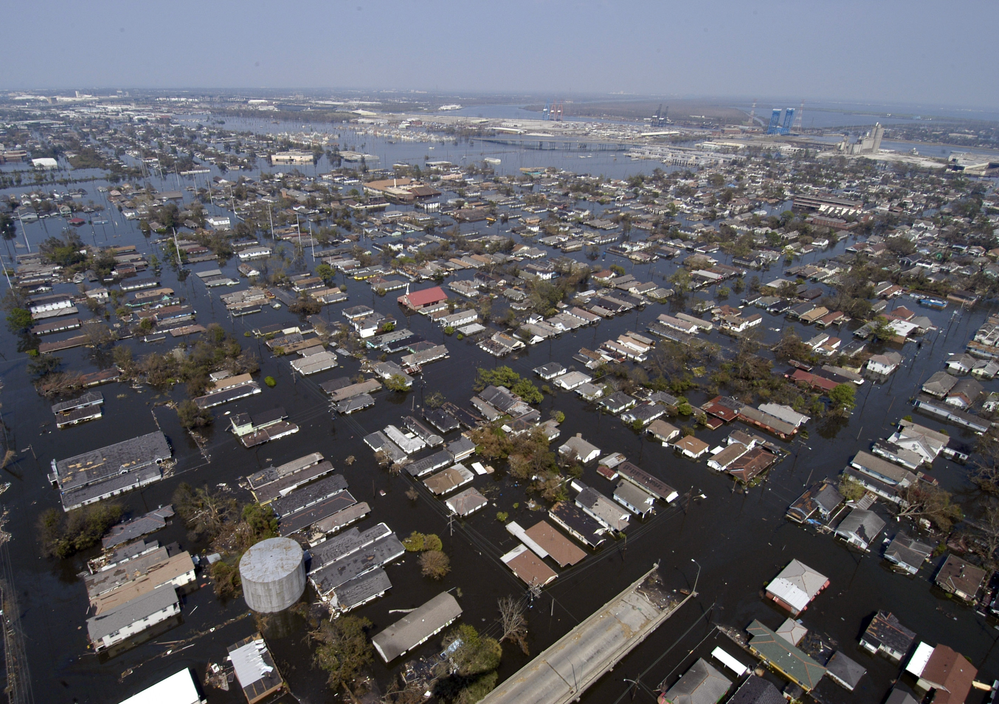

# Urbanisation and Floods
Floods are natural and seasonal phenomena that play an important environmental role.
However, human settlements interfere with flood patterns, majoring their magnitude and
frequency of occurrence, turning higher the associated level of risk regarding people,
buildings and economic activities. Urban floods range from localised micro-drainage
problems, inundating streets and troubling pedestrians and urban traffic, to major
inundation of large portions of the city, when both micro and macro-drainage fail to
accomplish their basic functions. These problems can lead to material losses to buildings
and their contents, damage to urban infrastructure, people relocation, increased risk of
diseases, deterioration of water quality, among others.

Considering it in a simple way, when rainfall occurs a portion of the total precipitation is
intercepted by vegetal canopy or retained at surface depressions, another part infiltrates and
the rest of it flows superficially over the terrain, conveying to channels and lower areas. The
main modification introduced by the urbanisation process to the water budget refers to an
increase of superficial runoff production, as can be seen in figure 1. Table 1 summarises the
different impacts of urbanisation over a river watershed. Studies held by Leopold (1968)
showed flood peaks majored about six times, when compared to floods in natural
conditions.
The fact that must be faced is that the city can influence runoff pattern changes and the state
of ecological systems not only within itself but also in the whole river system downstream,
including its surroundings. This fact, historically, resulted in shifting the traditional
conveyance approach in stormwater management, during the 1970s, to the storage approach
with a focus on detention, retention and recharge. Later on, the evolution of this concept,
during 1980s and 1990s, made stormwater to be considered as a significant source of
pollution, and the goals of stormwater management shifted again in order to protect natural
water cycle and ecological systems by the introduction of local source control, flow
attenuation measures and water quality treatment systems such as retention ponds,
wetlands and others (Niemczynowicz, 1999).
Flood control concepts are evolving continuously, accompanying historical demands of
urbanisation and its consequences. When a city starts to grow near a river, at a first moment,
this city can only be inundated in extreme events, when natural floods occupy larger
portions of floodplain. Urbanisation, however, changes landscape patterns, aggravating
floods by increasing surface runoff flows. In this way, floods become greater in magnitude
and time of permanence, occurring even more frequently.
The traditional approach for this problem focused on the drainage net itself, arranging
channels and pipes in an artificial flow net system, with the objective to convey the
exceeding waters away from the interest sites. At this initial moment, the canalisation
solution is able to deal with floods in a certain area, transferring waters downstream with no
major consequences. As time passes, urbanisation grows and more areas of the watershed
turn impervious. Upstream development stresses the system as a whole and the drainagenet fails once again. By this time, it becomes difficult to depend exclusively on improving
channels conveyance capacity to try to adjust the system behaviour.
Urbanisation itself limits river canalisation enlargement. Streets, buildings and urban
facilities now occupy banks and the original flood plain. Upstream reaches of the main river
cannot be canalised without aggravating downstream problems, where the former city area
lays. Focus now must be moved to a systemic approach, where the whole basin must be
considered. Distributed actions spread around the basin comply with the drainage net in
order to control generation of flows. Spatial and temporal aspects must be considered
together in a way that the proposed set of solutions may reorganise flow patterns and
minimise floods. In this context, not only water quantity is important, but also water quality
is an issue to be considered. Distributed interventions over the urbanised basin can also act
on the control of diffuse pollution from watershed washing. Here arises the concept of
sustainable drainage, which states that drainage systems have to be conceived in order to
minimise impacts of urbanisation over natural flow patterns, joining quantity and quality
aspects, meeting technical, social, economic and political goals, without transferring costs in
space or time.
In order to illustrate the interaction between urban development and flood control, as
discussed above, table 2 pictures a schematic frame of a hypothetical basin urbanisation
process. Knowing the sequence of facts presented in this table, it is possible to say that it
would be easier to imagine another course of actions, working in a preventive way and
avoiding undesirable flooding. Planning in advance, mapping of flood hazard prone areas,
developing environmental education campaigns, establishing adequate legislation, in order
to restrict runoff generation, among other measures, would configure a set of procedures
that could allow a rational coexistence of human settlements with natural floods.
However, it is impossible to prevent everything, as it is impossible to go back in time. The
historical aspects of urban development lead to all sort of established situations, where
urban floods occur. There is not one best answer for this problem. Each basin has to be
considered with its own characteristics, particularities and historical background, once the
diversity involved may arise lots of differences from case to case. However, many studies
have been developed in order to propose new concepts and alternatives.
Macaitis (1994) edited a book for American Society of Civil Engineers, where it is presented
the concept of urban drainage rehabilitation. This book showed a series of studies that
focused on identifying urban drainage functioning, defining maintenance procedures and
proposing complementing structures (as ponds, by-passes, flood-gates, etc), in order to
allow system operation to minimise flood impacts. Hunter (1994), in a paper presented at
this book stressed that it is important to maintain channel conveyance capacity, by treating
flood causes and not its consequences. A drainage system working as designed can be able
to sustain nearby communities safety and health.
Coffman et al. (1999) proposed a design concept of low impact development (LID). LID
design adopts a set of procedures that try to understand and reproduce hydrologic
behaviour prior to urbanisation. In this context, multifunctional landscapes appear as useful
elements in urban mesh, in order to allow rescuing infiltration and detention characteristics
of the natural watershed.
In a similar way, recent trends involve the use best management practices (BMP) in drainage
systems design. Best management practices work in a distributed way over the watershed,
integrating water quantity and water quality control.

